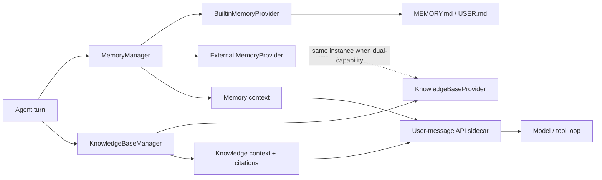

# Memory and Knowledge Base Architecture

## Purpose and boundary

Hermes treats memory and knowledge as different capabilities even when one
backend implements both.

- **Memory** is interaction-derived state: `MEMORY.md`, `USER.md`, user facts,
  preferences, session observations, and provider-managed long-term recall.
- **Knowledge Base** is externally sourced material: files, URLs, project or
  organization documents, indexed chunks, and their citations/provenance.
- **Session history** remains in `SessionDB` and is retrieved by
  `session_search`; it is not silently promoted into long-term memory.
- **Context files** (`AGENTS.md`, `CLAUDE.md`, `.cursorrules`, `SOUL.md`) and
  **Skills** retain their current prompt/progressive-disclosure behavior. They
  are not a document index.

Embedding, ranking, vector storage, parsing, and chunking stay provider-owned
for now. A future shared backend should be introduced only when two concrete
providers need the same implementation.

## Runtime architecture



The API sidecar order is stable:

1. clean user message;
2. `<memory-context>`;
3. `<knowledge-context>`;
4. general plugin context.

The sidecar is persisted with the clean SessionDB row, preserving the exact
bytes replayed on later turns and therefore Hermes' prompt-cache invariant.

## Memory module

### Responsibilities

`agent/memory_provider.py` defines the provider contract.
`agent/memory_manager.py` owns registration, recall timeout/fallback, serialized
post-turn writes, session/compression hooks, provider tool routing, and mirroring
of successful built-in writes.

`agent/builtin_memory_provider.py` adapts the existing `MemoryStore`. The storage
implementation remains in `tools/memory_tool.py` and keeps its existing file
locking, atomic writes, injection scanning, approval gate, de-duplication, and
character budgets.

The compatibility attribute `AIAgent._memory_store` remains available to
diagnostic/compression code, but prompt assembly and the memory tool loop use
the provider boundary. In the compatibility-only `skip_memory=True` plus
`memory`-toolset mode, the tool calls `BuiltinMemoryProvider` directly while
provider lifecycle, recall, and prompt injection remain disabled as before.

### Lifecycle

- Agent initialization creates the built-in adapter when either memory target
  is enabled.
- The active `memory.provider`, if any, is loaded by the existing single-select
  discovery mechanism.
- `on_turn_start` and `recall_memory` run before the model call.
- Completed, non-interrupted turns are passed to `sync_turn`; next-turn warming
  is queued on the manager's serialized daemon worker.
- Compression calls `on_pre_compress` and session rotation calls
  `on_session_switch`.
- Real CLI/Gateway session boundaries call `on_session_end`, drain pending
  writes, then shut providers down.

### Scope

`ProviderScope` is intentionally limited to persistence/retrieval identity. It
contains user, agent/profile, session, project, task, workspace, platform, and
Hermes-home identifiers. Existing providers keep receiving legacy initialize
kwargs. New providers should use `recall_memory(..., scope=...)`; the default
adapter bridges this method to legacy `prefetch`.

Built-in files remain profile-scoped under `$HERMES_HOME/memories`. They do not
claim per-user or per-project isolation. Providers that need those boundaries
must key their storage from `ProviderScope`.

## Knowledge Base module

### Responsibilities

`agent/knowledge_provider.py` defines resource operations and the structured
`KnowledgeSearchResult`/`KnowledgeCitation` types. A provider may implement:

- resource ingestion and parsing;
- indexing and index rebuild;
- scoped search;
- resource update/delete;
- provider-specific read/search/ingestion tools.

`agent/knowledge_base_manager.py` owns single-provider selection, scoped
delegation, fail-soft search, context-size limiting, citation formatting, and
tool routing. Search failures return a degraded result instead of breaking the
Agent turn. No configured provider is a valid empty-KB state.

### Default implementation

Hermes does not add a new document engine in this refactor. OpenViking already
contains both memory and resource capabilities, so it is adapted as the first
`KnowledgeBaseProvider` while remaining the same runtime instance selected by
`memory.provider: openviking`.

The Memory Manager owns that instance's initialization and shutdown exactly
once. Memory schemas are `viking_remember`/`viking_forget`; knowledge schemas
are `viking_search`/`viking_read`/`viking_browse`/`viking_add_resource`.
Automatic resource recall is separately labeled as knowledge. The existing
OpenViking resource-recall opt-in remains respected.

## Configuration

Existing memory configuration and CLI/API behavior are unchanged:

```yaml
memory:
  memory_enabled: true
  user_profile_enabled: true
  provider: ""          # or an existing provider name

knowledge:
  enabled: true
  max_context_chars: 12000
```

`knowledge.enabled: false` disables KB adaptation without disabling memory.
With no knowledge-capable provider the section is a no-op. Disabling memory
files does not disable a configured external provider; toolset visibility keeps
the existing `memory` toolset compatibility rule.

## Adding a Memory Provider

1. Implement `MemoryProvider` in a standalone plugin.
2. Keep `get_tool_schemas()` for compatibility and optionally implement
   `get_memory_tool_schemas()` when the provider has multiple capabilities.
3. Use `ProviderScope` for user/session/project isolation in new recall code.
4. Make `sync_turn` non-blocking or safe for the manager's serialized worker.
5. Implement session switch/end and shutdown hooks if state is cached.
6. Register through the existing memory-provider discovery and setup flow.

New third-party providers should not be added under the in-tree
`plugins/memory/` directory; Hermes policy requires standalone plugin repos.

## Adding a Knowledge Base Provider

1. Implement `KnowledgeBaseProvider` and return structured search results with
   stable source URIs and resource/chunk identifiers.
2. Implement only the resource operations the backend supports; unsupported
   operations should raise `NotImplementedError` with a clear message.
3. Keep parsing, chunking, embedding, and index SDK details inside the provider.
4. Register the provider with `KnowledgeBaseManager`; if the same instance is
   lifecycle-owned elsewhere, register it with `owns_lifecycle=False`.
5. Test empty indexes, failures, scope isolation, provenance, and tool-name
   conflicts without requiring a live external service.

A dedicated knowledge-plugin discovery/setup flow is intentionally deferred
until Hermes has an independently configured KB provider. The Manager/Provider
boundary is the stable integration point; general plugin hooks are not a
substitute for this typed contract.

## Future adapters

No adapter below is implemented by this refactor.

- **AgentScope ReMe:** implement `MemoryProvider` for episodic/procedural memory
  and map ReMe namespaces to `ProviderScope`. If its document store is also
  used, expose that through a separate `KnowledgeBaseProvider` adapter rather
  than returning documents as memories.
- **Mem0:** the repository's existing historical Mem0 provider remains intact.
  A future revision can adopt scope-aware recall and structured memory records
  behind `MemoryProvider` without changing the Agent loop. It should not be
  used as a document KB unless an explicit KB adapter preserves sources.
- **Graphiti:** map user/project namespaces and temporal facts to
  `MemoryProvider`; preserve graph edge/time metadata in provider metadata.
  External documents feeding the graph should enter through a separate KB
  ingestion adapter so source provenance is not lost.
- **Other memory systems:** implement the Memory ABC and scope contract; no
  Agent-loop changes are required.
- **Other RAG/document systems:** implement the KB ABC, return citations, and
  keep vector/database migrations within the plugin or its service.

## Known limitations

- Built-in files are profile-scoped, not user/session/project-scoped.
- Existing memory providers still use heterogeneous legacy sync/write models;
  `ProviderScope` is currently guaranteed on recall and KB operations.
- Built-in-to-external write mirroring is best-effort, not transactional.
- OpenViking remains packaged under the historical memory-plugin directory;
  the capability split is runtime/API-level, not a filesystem move.
- OpenViking's explicit `viking_search` tool retains its historical hybrid
  search behavior; only automatic recall/injection is strictly split into
  memory and knowledge channels.
- KB discovery, CLI setup, background ingestion jobs, and storage migrations
  are deferred until an independent provider requires them.
- Knowledge context uses a character cap; Hermes does not gain a new global
  token-budget framework in this change.
- Session history, Skills, and context files remain separate systems by design.
